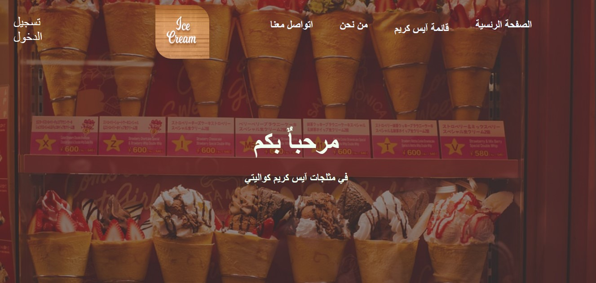

# 🌐 second-project

A simple and clean website built using **HTML** and **CSS**  **JS** — created as a practice project to improve my front-end web development skills.

---

## 📄 Pages Included

| Page         | Description             | Link                                                                 |
|--------------|-------------------------|----------------------------------------------------------------------|
| 🏠 Home       | Landing page             | [Open Home](https://mohammedhassan-mh.github.io/second-project/)   |
| ℹ️ About      | About me or the site     | [Open About](https://mohammedhassan-mh.github.io/second-project/)  |
| 📞 Contact    | Contact form/details     | [Open Contact](https://mohammedhassan-mh.github.io/second-project/) |
| 🔐 Login      | Sample login form        | [Open Login](https://mohammedhassan-mh.github.io/second-project/)  |

> 📝 *Replace `mohammedhassan` with your actual GitHub username.*

---

## 🖼️ Project Preview

  
*Replace with an actual image or screenshot from your project.*

---

## 🚀 Features

- ✅ Responsive HTML layout  
- ✅ Clean, modern CSS styling  
- ✅ Semantic HTML5 structure  
- ✅ Simple login form UI (non-functional)  

---

## 🛠️ Technologies Used

- HTML5  
- CSS3
- JS
- [Visual Studio Code](https://code.visualstudio.com/) (for development)

---

## 📡 Live Demo

🔗 [View Live Site](https://mohammedhassan-mh.github.io/First-project)

> 📌 Replace `mohammedhassan` with your actual GitHub username.

---

## ✍️ Author

**Mohammed Hassan**  
📧 youremail@example.com  
🌐 [Portfolio / Website (optional)](https://mohammedhassan-mh.com)

---

## 📄 License

This project is licensed under the **MIT License** — feel free to use, modify, and share it.
